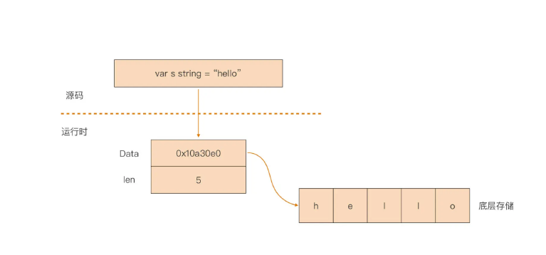
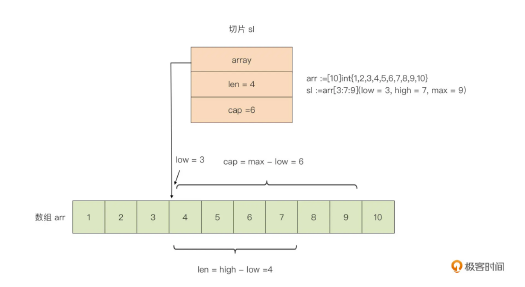
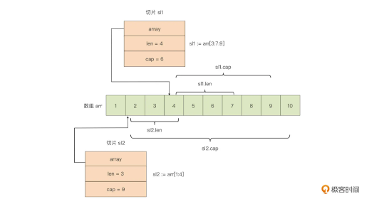

## note
### 变量声明

如果没有显式为变量赋予初值，Go 编译器会为变量赋予这个类型的零值。 整数类型是0、浮点类型是0.0 、布尔是false、指针、接口、切片、channel、map和函数是nil

### 区别总结空结构和空接口

- struct{} 是一个空结构体，表示一个不包含任何字段的结构体；而 interface{} 是一个空接口，表示一个不包含任何方法的接口。
- 空结构体通常用于表示不需要存储任何数据的情况，而空接口通常用于表示不限定具体类型的情况。
- 空结构体在并发编程中常用作信号或事件的通知；空接口常用于需要接收任意类型的值的场景。

在实际编程中，空结构体和空接口都有其特定的用途，可以根据具体情况选择使用。

### byte类型 => 字节类型

在 gRPC 请求中，byte 类型通常用于表示二进制数据，例如文件内容、图像数据、视频数据等。gRPC 使用 Protocol Buffers 作为默认的序列化和反序列化格式，而 Protocol Buffers 支持将二进制数据表示为字节序列。

在 gRPC 中，您可能会使用 byte 类型来传输二进制数据。例如，如果您有一个 gRPC 服务，需要接收一个文件作为输入，您可以将文件内容表示为 byte 类型，并在 gRPC 请求中传输这些字节。
```
// 定义 gRPC 请求消息
message UploadFileRequest {
  bytes file_content = 1;
}
// 生成的 gRPC 服务端代码
func (s *Server) UploadFile(ctx context.Context, req *pb.UploadFileRequest) (*pb.UploadFileResponse, error) {
    fileContent := req.GetFileContent()
    // 处理文件内容
    return &pb.UploadFileResponse{}, nil
}

```
### go vet
Go 官方提供了 go vet 工具可以用于对 Go 源码做一系列静态检查
```shell
go install golang.org/x/tools/go/analysis/passes/shadow/cmd/shadow@latest
go: downloading golang.org/x/tools v0.1.5
go: downloading golang.org/x/mod v0.4.2
```
我们就可以通过 go vet 扫描代码并检查这里面有没有变量遮蔽的问题

```shell
go vet -vettool=$(which shadow) -strict complex.go 
./complex.go:13:12: declaration of "err" shadows declaration at line 11
```
### 代码块与作用域(避免变量遮蔽的原则)

代码块有显式与隐式之分，显式代码块就是包裹在一对配对大括号内部的语句序列，而隐式代码块则不容易肉眼分辨，它是通过 Go 语言规范明确规定的。隐式代码块有五种，分别是宇宙代码块、包代码块、文件代码块、分支控制语句隐式代码块，以及 switch/select 的子句隐式代码块，理解隐式代码块是理解代码块概念以及后续作用域概念的前提与基础。

作用域的概念是 Go 源码编译过程中标识符（包括变量）的一个属性。Go 编译器会校验每个标识符的作用域，如果它的使用范围超出其作用域，编译器会报错。

不过呢，我们可以使用代码块的概念来划定每个标识符的作用域。划定原则就是声明于外层代码块中的标识符，其作用域包括所有内层代码块。但是，Go 的这种作用域划定也带来了变量遮蔽问题。简单的遮蔽问题，我们通过分析代码可以很快找出，复杂的遮蔽问题，即便是通过 go vet 这样的静态代码分析工具也难于找全。

因此，我们只有了解变量遮蔽问题本质，在日常编写代码时注意同名变量的声明，注意短变量声明与控制语句的结合，才能从根源上尽量避免变量遮蔽问题的发生。

### go类型系统

Go 语言的类型大体可分为：

#### 基本数据类型(整型溢出问题、整型符号位采用 2 的补码但是格式化字面值仍是用原码)：数值类型(整型、浮点型(包含科学计数)、复数类型(z=a+bi))、字符串

Go 的补码是通过原码逐位取反后再加 1 得到的，比如，我们以 -127 这个值为例，它的补码转换过程就是这样的：

计算机中负数用的是补码表示。 负数的补码是其绝对值取反码，再加1.

float 其实相当复杂，开发中如果能避开就避开，例如金钱单位只有美元或者人民币我建议以分作为单位或者使用decimal

#### 讲讲字符串类型的设计(go原生支持字符串: 注意区分字符串长度(go中string指字节长度)和字符长度)

- 第一点：string 类型的数据是不可变的，提高了字符串的并发安全性和存储利用率。
- 第二点：没有结尾 ’\0’， 而且获取长度的时间复杂度是常数时间，消除了获取字符串长度的开销。
- 第三点：原生支持“所见即所得”的原始字符串，大大降低构造多行字符串时的心智负担。
- 第四点：对非ASCII字符提供原生支持，消除了源码在不同环境下显示乱码的可能。

Go 语言中的字符串值也是一个可空的字节序列，字节序列中的字节个数称为该字符串的长度。

字符串string类型的存储：string 类型其实是一个“描述符”，它本身并不真正存储字符串数据，而仅是由一个指向底层存储的指针和字符串的长度字段组成的。



Go语言源文件默认采用的是Unicode，字符集Unicode 是一个字符编码标准，旨在为世界上所有的字符和符号提供唯一的编号（编码点），使得在不同的计算机系统和语言之间可以一致地表示和处理文本。

总结
- JavaScript 中 str.length 返回的是 UTF-16 码元的数量，对于 BMP 以外的字符会返回大于实际字符数量的值。
- Go 中 len(str) 返回的是字节的数量，对于多字节字符（例如大于 U+007F 的字符）会返回大于实际字符数量的值。

在go语言中：单引号是表示字符、双引号是字符串、模版字符串表示所见即所得的原始字符串(一般用于多行字符串)

如果你需要计算实际的 Unicode 字符数量，而不是字节或码元数量，可以在两种语言中使用对应的方法。可以分别在 JavaScript 中使用 Array.from() 或 split() 方法，在 Go 中使用 []rune 转换。

#### 进制转换
- 10进制 => 八进制、十六进制、二进制 => 整数部分：除以进制数，反向取余数，直到商为0终止。小数部分：乘以进制数，取整顺序输出。
- 二进制、八进制、十六进制 => 十进制 => 二进制、八进制、十六进制转换为十进制当中的整数部分从右往左指数从0开始递增，小数部分从左往右从-1开始递减，原理都是一样的。
#### 位运算
位运算是计算机处理二进制数据的一种基本运算方式。它直接对整数类型的二进制表示进行操作，这种操作通常非常高效。下面是一些常见的位运算及其运算规则：

##### 常见的位运算符

按位与 (&)：

规则：对应的位都为1时，结果为1，否则为0。

示例：5 & 3 -> 0101 & 0011 -> 0001 -> 1

按位或 (|)：

规则：对应的位有一个为1时，结果为1，否则为0。

示例：5 | 3 -> 0101 | 0011 -> 0111 -> 7

按位异或 (^)：

规则：对应的位不同则为1，相同则为0。

示例：5 ^ 3 -> 0101 ^ 0011 -> 0110 -> 6

按位取反 (~)：

规则：每个位取反，0变1，1变0。

示例：^5 -> ~0101 -> 1010（按位取反后的值取决于整数的表示方式和位数）

左移 (<<)：

规则：将数字的所有位向左移动指定的位数，右侧用0填充。

示例：3 << 2 -> 0011 << 2 -> 1100 -> 12

右移 (>>)：

规则：将数字的所有位向右移动指定的位数，左侧用0（对于无符号数）或符号位的值（对于有符号数）填充。

示例：8 >> 2 -> 1000 >> 2 -> 0010 -> 2

### 复合数据类型

包括数组、切片（slice）、map、结构体，以及像 channel 这类用于并发程序设计的高级复合数据类型。


切片好比打开了一个访问与修改数组的“窗口”，通过这个窗口，我们可以直接操作底层数组中的部分元素。这有些类似于我们操作文件之前打开的“文件描述符”（Windows 上称为句柄），通过文件描述符我们可以对底层的真实文件进行相关操作。可以说，切片之于数组就像是文件描述符之于文件。

在 Go 语言中，数组更多是“退居幕后”，承担的是底层存储空间的角色。切片就是数组的“描述符”，也正是因为这一特性，切片才能在函数参数传递时避免较大性能开销。因为我们传递的并不是数组本身，而是数组的“描述符”，而这个描述符的大小是固定的（见上面的三元组结构），无论底层的数组有多大，切片打开的“窗口”长度有多长，它都是不变的。此外，我们在进行数组切片化的时候，通常省略 max，而 max 的默认值为数组的长度。

另外，针对一个已存在的数组，我们还可以建立多个操作数组的切片，这些切片共享同一底层数组，切片对底层数组的操作也同样会反映到其他切片中。下面是为数组 arr 建立的两个切片的内存表示：

这里我们要清楚一个概念：切片与数组最大的不同，就在于其长度的不定长，这种不定长需要 Go 运行时提供支持，这种支持就是切片的“动态扩容”。

“动态扩容”指的就是，当我们通过 append 操作向切片追加数据的时候，如果这时切片的 len 值和 cap 值是相等的，也就是说切片底层数组已经没有空闲空间再来存储追加的值了，Go 运行时就会对这个切片做扩容操作，来保证切片始终能存储下追加的新值。

append 操作的这种自动扩容行为，有些时候会给我们开发者带来一些困惑，比如基于一个已有数组建立的切片，一旦追加的数据操作触碰到切片的容量上限（实质上也是数组容量的 上界)，切片就会和原数组解除“绑定”，后续对切片的任何修改都不会反映到原数组中了。这种因切片的自动扩容而导致的“绑定关系”解除，有时候会成为你实践道路上的一个小陷阱，你一定要注意这一点。

在大多数场合，我们都会使用切片以替代数组，原因之一是切片作为数组“描述符”的轻量性，无论它绑定的底层数组有多大，传递这个切片花费的开销都是恒定可控的；另外一个原因是切片相较于数组指针也是有优势的，切片可以提供比指针更为强大的功能，比如下标访问、边界
溢出校验、动态扩容等。而且，指针本身在 Go 语言中的功能也受到的限制，比如不支持指针算术运算。

### 接口类型

