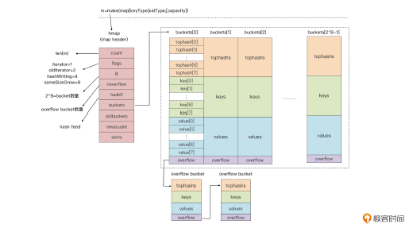
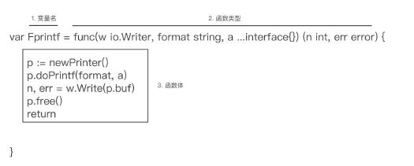
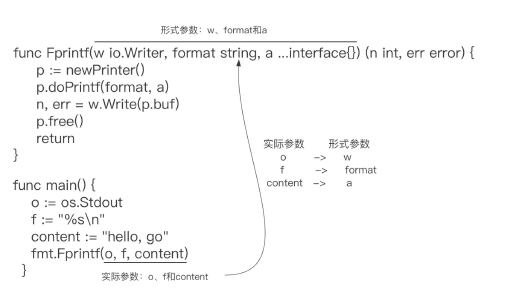

## note

### 变量声明
> 如果没有显式为变量赋予初值，Go 编译器会为变量赋予这个类型的零值。 整数类型是0、浮点类型是0.0 、布尔是false、指针、接口、切片、channel、map和函数是nil


### 区别总结空结构和空接口

- struct{} 是一个空结构体，表示一个不包含任何字段的结构体；而 interface{} 是一个空接口，表示一个不包含任何方法的接口。
- 空结构体通常用于表示不需要存储任何数据的情况，而空接口通常用于表示不限定具体类型的情况。
- 空结构体在并发编程中常用作信号或事件的通知；空接口常用于需要接收任意类型的值的场景。

> 在实际编程中，空结构体和空接口都有其特定的用途，可以根据具体情况选择使用。

### byte类型 => 字节类型

> 在 gRPC 请求中，byte 类型通常用于表示二进制数据，例如文件内容、图像数据、视频数据等。gRPC 使用 Protocol Buffers 作为默认的序列化和反序列化格式，而 Protocol Buffers 支持将二进制数据表示为字节序列。

> 在 gRPC 中，您可能会使用 byte 类型来传输二进制数据。例如，如果您有一个 gRPC 服务，需要接收一个文件作为输入，您可以将文件内容表示为 byte 类型，并在 gRPC 请求中传输这些字节。
```
// 定义 gRPC 请求消息
message UploadFileRequest {
  bytes file_content = 1;
}
// 生成的 gRPC 服务端代码
func (s *Server) UploadFile(ctx context.Context, req *pb.UploadFileRequest) (*pb.UploadFileResponse, error) {
    fileContent := req.GetFileContent()
    // 处理文件内容
    return &pb.UploadFileResponse{}, nil
}

```
### go vet
Go 官方提供了 go vet 工具可以用于对 Go 源码做一系列静态检查
```shell
go install golang.org/x/tools/go/analysis/passes/shadow/cmd/shadow@latest
go: downloading golang.org/x/tools v0.1.5
go: downloading golang.org/x/mod v0.4.2
```
我们就可以通过 go vet 扫描代码并检查这里面有没有变量遮蔽的问题

```shell
go vet -vettool=$(which shadow) -strict complex.go 
./complex.go:13:12: declaration of "err" shadows declaration at line 11
```
### 代码块与作用域(避免变量遮蔽的原则)

> 代码块有显式与隐式之分，显式代码块就是包裹在一对配对大括号内部的语句序列，而隐式代码块则不容易肉眼分辨，它是通过 Go 语言规范明确规定的。隐式代码块有五种，分别是宇宙代码块、包代码块、文件代码块、分支控制语句隐式代码块，以及 switch/select 的子句隐式代码块，理解隐式代码块是理解代码块概念以及后续作用域概念的前提与基础。

> 作用域的概念是 Go 源码编译过程中标识符（包括变量）的一个属性。Go 编译器会校验每个标识符的作用域，如果它的使用范围超出其作用域，编译器会报错。

> 不过呢，我们可以使用代码块的概念来划定每个标识符的作用域。划定原则就是声明于外层代码块中的标识符，其作用域包括所有内层代码块。但是，Go 的这种作用域划定也带来了变量遮蔽问题。简单的遮蔽问题，我们通过分析代码可以很快找出，复杂的遮蔽问题，即便是通过 go vet 这样的静态代码分析工具也难于找全。

> 因此，我们只有了解变量遮蔽问题本质，在日常编写代码时注意同名变量的声明，注意短变量声明与控制语句的结合，才能从根源上尽量避免变量遮蔽问题的发生。

### go类型系统

Go 语言的类型大体可分为：

#### 基本数据类型(整型溢出问题、整型符号位采用 2 的补码但是格式化字面值仍是用原码)：数值类型(整型、浮点型(包含科学计数)、复数类型(z=a+bi))、字符串

Go 的补码是通过原码逐位取反后再加 1 得到的，比如，我们以 -127 这个值为例，它的补码转换过程就是这样的：

计算机中负数用的是补码表示。 负数的补码是其绝对值取反码，再加1.

float 其实相当复杂，开发中如果能避开就避开，例如金钱单位只有美元或者人民币我建议以分作为单位或者使用decimal

#### 讲讲字符串类型的设计(go原生支持字符串: 注意区分字符串长度(go中string指字节长度)和字符长度)

- 第一点：string 类型的数据是不可变的，提高了字符串的并发安全性和存储利用率。
- 第二点：没有结尾 ’\0’， 而且获取长度的时间复杂度是常数时间，消除了获取字符串长度的开销。
- 第三点：原生支持“所见即所得”的原始字符串，大大降低构造多行字符串时的心智负担。
- 第四点：对非ASCII字符提供原生支持，消除了源码在不同环境下显示乱码的可能。

Go 语言中的字符串值也是一个可空的字节序列，字节序列中的字节个数称为该字符串的长度。

> 字符串string类型的存储：string 类型其实是一个“描述符”，它本身并不真正存储字符串数据，而仅是由一个指向底层存储的指针和字符串的长度字段组成的。


> Go语言源文件默认采用的是Unicode，字符集Unicode 是一个字符编码标准，旨在为世界上所有的字符和符号提供唯一的编号（编码点），使得在不同的计算机系统和语言之间可以一致地表示和处理文本。

#### 总结
- JavaScript 中 str.length 返回的是 UTF-16 码元的数量，对于 BMP 以外的字符会返回大于实际字符数量的值。
- Go 中 len(str) 返回的是字节的数量，对于多字节字符（例如大于 U+007F 的字符）会返回大于实际字符数量的值。

> 在go语言中：单引号是表示字符、双引号是字符串、模版字符串表示所见即所得的原始字符串(一般用于多行字符串)

> 如果你需要计算实际的 Unicode 字符数量，而不是字节或码元数量，可以在两种语言中使用对应的方法。可以分别在 JavaScript 中使用 Array.from() 或 split() 方法，在 Go 中使用 []rune 转换。

#### 进制转换
- 10进制 => 八进制、十六进制、二进制 => 整数部分：除以进制数，反向取余数，直到商为0终止。小数部分：乘以进制数，取整顺序输出。
- 二进制、八进制、十六进制 => 十进制 => 二进制、八进制、十六进制转换为十进制当中的整数部分从右往左指数从0开始递增，小数部分从左往右从-1开始递减，原理都是一样的。
#### 位运算
> 位运算是计算机处理二进制数据的一种基本运算方式。它直接对整数类型的二进制表示进行操作，这种操作通常非常高效。下面是一些常见的位运算及其运算规则：

##### 常见的位运算符

按位与 (&)：

规则：对应的位都为1时，结果为1，否则为0。

示例：5 & 3 -> 0101 & 0011 -> 0001 -> 1

按位或 (|)：

规则：对应的位有一个为1时，结果为1，否则为0。

示例：5 | 3 -> 0101 | 0011 -> 0111 -> 7

按位异或 (^)：

规则：对应的位不同则为1，相同则为0。

示例：5 ^ 3 -> 0101 ^ 0011 -> 0110 -> 6

按位取反 (~)：

规则：每个位取反，0变1，1变0。

示例：^5 -> ~0101 -> 1010（按位取反后的值取决于整数的表示方式和位数）

左移 (<<)：

规则：将数字的所有位向左移动指定的位数，右侧用0填充。

示例：3 << 2 -> 0011 << 2 -> 1100 -> 12

右移 (>>)：

规则：将数字的所有位向右移动指定的位数，左侧用0（对于无符号数）或符号位的值（对于有符号数）填充。

示例：8 >> 2 -> 1000 >> 2 -> 0010 -> 2

### 复合数据类型

包括数组、切片（slice）、map、结构体，以及像 channel 这类用于并发程序设计的高级复合数据类型。

#### 数组、切片(一组连续存储的同构类型元素集合)

> 在 Go 语言中，数组（array）是基本类型，而切片（slice）是引用类型。这两个类型在内存分配和参数传递方面有显著的区别。

> 数组是值类型。将数组赋值给另一个数组或将数组作为参数传递给函数时，会复制整个数组的内容，而不是引用。因此，数组的赋值和传递都是深拷贝。

> 切片是引用类型。将切片赋值给另一个切片或将切片作为参数传递给函数时，传递的是引用，而不是复制底层数组的内容。因此，对切片的修改会影响到引用的同一个底层数组。切片包含指向底层数组的指针、长度和容量。切片可以引用数组的一部分，并且可以共享相同的底层数组。


> 切片好比打开了一个访问与修改数组的“窗口”，通过这个窗口，我们可以直接操作底层数组中的部分元素。这有些类似于我们操作文件之前打开的“文件描述符”（Windows 上称为句柄），通过文件描述符我们可以对底层的真实文件进行相关操作。可以说，切片之于数组就像是文件描述符之于文件。

> 在 Go 语言中，数组更多是“退居幕后”，承担的是底层存储空间的角色。切片就是数组的“描述符”，也正是因为这一特性，切片才能在函数参数传递时避免较大性能开销。因为我们传递的并不是数组本身，而是数组的“描述符”，而这个描述符的大小是固定的（见上面的三元组结构），无论底层的数组有多大，切片打开的“窗口”长度有多长，它都是不变的。此外，我们在进行数组切片化的时候，通常省略 max，而 max 的默认值为数组的长度。

> 另外，针对一个已存在的数组，我们还可以建立多个操作数组的切片，这些切片共享同一底层数组，切片对底层数组的操作也同样会反映到其他切片中。下面是为数组 arr 建立的两个切片的内存表示：


> 这里我们要清楚一个概念：切片与数组最大的不同，就在于其长度的不定长，这种不定长需要 Go 运行时提供支持，这种支持就是切片的“动态扩容”。

> “动态扩容”指的就是，当我们通过 append 操作向切片追加数据的时候，如果这时切片的 len 值和 cap 值是相等的，也就是说切片底层数组已经没有空闲空间再来存储追加的值了，Go 运行时就会对这个切片做扩容操作，来保证切片始终能存储下追加的新值。

> append 操作的这种自动扩容行为，有些时候会给我们开发者带来一些困惑，比如基于一个已有数组建立的切片，一旦追加的数据操作触碰到切片的容量上限（实质上也是数组容量的 上界)，切片就会和原数组解除“绑定”，后续对切片的任何修改都不会反映到原数组中了。这种因切片的自动扩容而导致的“绑定关系”解除，有时候会成为你实践道路上的一个小陷阱，你一定要注意这一点。

> 在大多数场合，我们都会使用切片以替代数组，原因之一是切片作为数组“描述符”的轻量性，无论它绑定的底层数组有多大，传递这个切片花费的开销都是恒定可控的；另外一个原因是切片相较于数组指针也是有优势的，切片可以提供比指针更为强大的功能，比如下标访问、边界
溢出校验、动态扩容等。而且，指针本身在 Go 语言中的功能也受到的限制，比如不支持指针算术运算。

#### map(map 是 Go 语言提供的一种抽象数据类型，它表示一组无序的键值对。)
- map 类型对 value 的类型没有限制，但是对 key 的类型却有严格要求，因为 map 类型要保证 key 的唯一性。
- Go 语言中要求，key 的类型必须支持“==”和“!=”两种比较操作符。
- 在 Go 语言中，函数类型、map 类型自身，以及切片只支持与 nil 的比较，而不支持同类型两个变量的比较。因此在这里，你一定要注意：函数类型、map 类型自身，以及切片类型是不能作为 map 的 key 类型的。

> 注意点：和切片类型变量一样，如果我们没有显式地赋予 map 变量初值，map 类型变量的默认值为 nil。

> 不过切片变量和 map 变量在这里也有些不同。初值为零值 nil 的切片类型变量，可以借助内置的 append 的函数进行操作，这种在 Go 语言中被称为“零值可用”。
但 map 类型，因为它内部实现的复杂性，无法“零值可用”。所以，如果我们对处于零值状态的 map 变量直接进行操作，就会导致运行时异常（panic），从而导致程序进程异常退出

在 Go 语言中，请使用“comma ok”惯用法对 map 进行键查找和键值读取操作。

在 Go 中，遍历 map 的键值对只有一种方法，那就是像对待切片那样通过 for range 语句对 map 数据进行遍历。

> 和切片类型一样，map 也是引用类型。这就意味着 map 类型变量作为参数被传递给函数或方法的时候，实质上传递的只是一个“描述符”（后面我们再讲这个描述符究竟是什么)，而不是整个 map 的数据拷贝，所以这个传递的开销是固定的，而且也很小。

> 和切片相比，map 类型的内部实现要更加复杂。Go 运行时使用一张哈希表(hash table)来实现抽象的 map 类型。运行时实现了 map 类型操作的所有功能，包括查找、插入、删除等。在编译阶段，Go 编译器会将 Go 语法层面的 map 操作，重写成运行时对应的函数调用。

map 类型在 Go 运行时层实现的示意图：


```
1. Go语言map的基本结构

Go语言中的map底层由多个bucket组成，每个bucket存储若干个键值对。通过哈希函数将键映射到相应的bucket，然后在bucket中存储具体的键值对。

2. bucket结构

每个bucket可以存储多个键值对。在Go 1.8及之后的版本中，每个bucket最多可以存储8个键值对。一个bucket的结构大致如下：

type bmap struct {
    tophash  [8]uint8
    keys     [8]keyType
    values   [8]valueType
    overflow *bmap
}

tophash：是一个数组，存储每个键的哈希值的高8位，用于快速比较和查找。
keys：存储具体的键。
values：存储具体的值。
overflow：指向下一个bucket，用于解决哈希冲突。

3. 哈希函数

当向map中插入一个键值对时，首先会对键进行哈希计算，得到一个哈希值。哈希值的高位决定了键应该插入到哪个bucket中。

hash := hashFunc(key)
bucketIndex := hash & (len(buckets) - 1)

4. 数据存储过程

哈希计算：对键进行哈希计算得到哈希值。
定位bucket：使用哈希值的低位来确定该键值对应该插入到哪个bucket中。
存储数据：将键值对存储到对应的bucket中，并存储哈希值的高8位到tophash数组中。
处理冲突：如果一个bucket已经存满了8个键值对，那么需要分配一个新的bucket，并通过overflow指针将其链接到当前bucket上。

5. 查找过程

查找键值对时：
哈希计算：对键进行哈希计算得到哈希值。
定位bucket：使用哈希值的低位来确定应该在哪个bucket中查找。
查找匹配项：在tophash数组中查找与哈希值高8位匹配的条目，然后依次比较这些条目的键是否与目标键相等。
处理冲突：如果没有在当前bucket中找到匹配的键值对，那么顺着overflow指针查找下一个bucket，直到找到匹配项或bucket链末尾。
6. 动态扩容

当map中的键值对数量增多导致哈希冲突频繁时，map会进行扩容。扩容的步骤包括：

分配一个更大的bucket数组，通常是当前容量的两倍。
重新计算所有键的哈希值并将它们分布到新的bucket数组中。

7. 示例代码

以下是一个简单的示例代码，展示了Go语言中map的基本用法：
package main

import "fmt"

func main() {
    m := make(map[string]int)
    m["foo"] = 1
    m["bar"] = 2

    fmt.Println(m["foo"]) // 输出: 1
    fmt.Println(m["bar"]) // 输出: 2
}


```
> 每个 bucket 的 tophash 区域其实是用来快速定位 key 位置的，这样就避免了逐个 key 进行比较这种代价较大的操作。尤其是当 key 是 size 较大的字符串类型时，好处就更突出了。这是一种以空间换时间的思路。


> 从上面的实现原理来看，充当 map 描述符角色的 hmap 实例自身是有状态的（hmap.flags），而且对状态的读写是没有并发保护的。所以说 map 实例不是并发写安全的，也不支持并发读写。如果我们对 map 实例进行并发读写，程序运行时就会抛出异常。

> 不过，如果我们仅仅是进行并发读，map 是没有问题的。而且，Go 1.9 版本中引入了支持并发写安全的 sync.Map 类型，可以用来在并发读写的场景下替换掉 map，如果你有这方面的需求。

> 另外，你要注意，考虑到 map 可以自动扩容，map 中数据元素的 value 位置可能在这一过程中发生变化，所以 Go 不允许获取 map 中 value 的地址，这个约束是在编译期间就生效的。

思考并实现一个方法，让我们能对 map 的进行稳定次序遍历？

思路：

> 可以用一个有序结构存储key,如slice,然后for这个slice,用key获取值。资料来源至：https://go.dev/blog/maps

> 使用链表存储可以得到有序的Map。有了描述符，再也不用担心传递性能问题了！原来多个bucket是为了降低Hash冲突，虽然一个bucket和多个bucket在查找Key时时间复杂度都是O(1)，但一个Bucket遇到Hash冲突的可能性要比多个高出很多。

> 单独对map中的key进行有序存储，然后再依据key的次序依次获取map中key对应的value.

#### struct 结构体
> 在 Go 中，提供这种聚合抽象能力的类型是结构体类型，也就是 struct。这一节课，我们就围绕着结构体的使用和内存表示，由外及里来学习 Go 中的结构体类型。

###### 结构体类型变量的初始化
> 有几种方式：零值初始化、复合字面值初始化，以及使用特定构造函数进行初始化，日常编码中最常见的是第二种。支持零值可用的结构体类型对于简化代码，改善体验具有很好的作用。另外，当复合字面值初始化无法满足要求的情况下，我们需要为结构体类型定义专门的构造函数，这种方式同样有广泛的应用。
##### 结构体类型的内存布局(https://geektutu.com/post/hpg-struct-alignment.html)

> 结构体类型是既数组类型之后，又一个以平铺形式存放在连续内存块中的类型。不过与数组类型不同，由于内存对齐的要求，结构体类型各个相邻字段间可能存在“填充物”，结构体的尾部同样可能被 Go 编译器填充额外的字节，满足结构体整体对齐的约束。正是因为这点，我们在定义结构体时，一定要合理安排字段顺序，要让结构体类型对内存空间的占用最小。

> Go 语言不支持在结构体类型定义中，递归地放入其自身类型字段，但却可以拥有自身类型的指针类型、以自身类型为元素类型的切片类型，以及以自身类型作为 value 类型的 map 类型的字段，你能思考一下其中的原因吗？

> 一个类型，它所占用的大小是固定的，因此一个结构体定义好的时候，其大小是固定的。 但是，如果结构体里面套结构体，那么在计算该结构体占用大小的时候，就会成死循环。 但如果是指针、切片、map等类型，其本质都是一个int大小(指针，4字节或者8字节，与操作系统有关)，因此该结构体的大小是固定的，记得老师前几节课讲类型的时候说过，类型就能决定内存占用的大小。
因此，结构体是可以接口自身类型的指针类型、以自身类型为元素类型的切片类型，以及以自身类型作为 value 类型的 map 类型的字段，而自己本身不行。 => 核心：因为指针、map、切片的变量元数据的内存占用大小是固定的。go是静态语言，对于一个类型，编译器要知道它的大小。如果嵌套T，那么编译器无法知道其大小。但如果是*T或[]T，编译器只需要知道指针大小以及切片这个“描述符”的大小即可。

### 控制语句(if、switch case、for)

> for range 循环形式与 for 语句经典形式差异较大，除了循环体保留了下来，其余组成部分都“不见”了。其实那几部分已经被融合到 for range 的语义中了。

> for range 对于 string 类型来说，每次循环得到的 v 值是一个 Unicode 字符码点，也就是 rune 类型值，而不是一个字节，返回的第一个值 i 为该 Unicode 字符码点的内存编码（UTF-8）的第一个字节在字符串内存序列中的位置。使用 for 经典形式与使用 for range 形式，对 string 类型进行循环操作的语义是不同的。

> 我们要对 map 进行循环操作，for range 是唯一的方法。每次循环，循环变量 k 和 v 分别会被赋值为 map 键值对集合中一个元素的 key 值和 value 值。

> channel 是 Go 语言提供的并发设计的原语，它用于多个 Goroutine 之间的通信，我们在后面的课程中还会详细讲解 channel。当 channel 类型变量作为 for range 语句的迭代对象时，for range 会尝试从 channel 中读取数据，使用形式是这样的：

```go
var c = make(chan int) 
for v := range c {
    // ... 
}
```
> 带 label 的 continue 语句，通常出现于嵌套循环语句中，被用于跳转到外层循环并继续执行外层循环语句的下一个迭代。

> 和 continue 语句一样，Go 也 break 语句增加了对 label 的支持。而且，和前面 continue 语句一样，如果遇到嵌套循环，break 要想跳出外层循环，用不带 label 的 break 是不够，因为不带 label 的 break 仅能跳出其所在的最内层循环。要想实现外层循环的跳出，我们还需给 break 加上 label。

#### for 语句的常见“坑”与避坑方法
问题一：循环变量的重用=>循环变量的值与你之前的“预期”不符
```go
// 看示例 09/bookstore/test/tst.go
func main() {
    var m = []int{1, 2, 3, 4, 5}
    for i, v := range m {
        go func() {
            time.Sleep(time.Second * 3)  
			fmt.Println(i, v)
        }
    }
    time.Sleep(time.Second * 10) // 这里的Sleep作用 => 确保所有 Goroutine 有时间完成输出
	// 在并发编程中，Goroutine 是轻量级线程，它们会在后台并发执行。当我们启动多个 Goroutine 时，它们不会阻塞主线程的执行。主线程可能会在 Goroutine 执行完成之前就退出，从而导致 Goroutine 还没来得及输出就被终止。
	// time.Sleep(time.Second * 10)作用是让主 Goroutine 休眠一段时间（这里是10秒），以确保在主 Goroutine 退出之前，所有启动的 Goroutine 有足够的时间完成它们的工作（输出内容）。
	// 为什么需要等待
    // 异步执行：Goroutine 是并发执行的，启动后会在后台运行，而主 Goroutine 会继续执行后续代码。
    // 程序退出：如果主 Goroutine 执行完毕，整个程序就会退出，无论后台的 Goroutine 是否已经完成。因此，如果不等待，可能会导致 Goroutine 还没输出结果，程序就已经结束了。
    // 解决方法
    // 在实际应用中，简单的 time.Sleep 是一种不严谨的做法，因为我们不确定确切需要等待的时间。推荐使用同步机制，如 sync.WaitGroup，确保所有 Goroutine 完成后再退出程序。
	// 使用 sync.WaitGroup
    // sync.WaitGroup 是一个用于等待一组 Goroutine 完成的同步机制。以下是如何使用它确保所有 Goroutine 完成后再退出
}
```
问题二：参与循环的是 range 表达式的副本 
> 用切片遍历可以解决数组遍历中由于副本导致修改原数组改变不生效问题？那切片是如何做到的呢？

> 切片在 Go 内部表示为一个结构体，由（array, len, cap）组成，其中 array 是指向切片对应的底层数组的指针，len 是切片当前长度，cap 为切片的最大容量。
所以，当进行 range 表达式复制时，我们实际上复制的是一个切片，也就是表示切片的结构体。表示切片副本的结构体中的 array，依旧指向原切片对应的底层数组，所以我们对切片副本的修改也都会反映到底层数组 a 上去。
而 v 再从切片副本结构体中 array 指向的底层数组中，获取数组元素，也就得到了被修改后的元素值。

问题三：遍历 map 中元素的随机性
> 如果我们在循环的过程中，对 map 进行了修改，那么这样修改的结果是否会影响后续迭代呢？这个结果和我们遍历 map 一样，具有随机性。

> 在“参与循环的是 range 表达式的副本”这一部分中，我们用切片替换了数组，实现了我们预期的输出，我想让你思考一下，除了换成切片这个方案之外，还有什么方案也能实现我们预期的输出呢？

```go
// 数组指针代替数组参与range遍历
func main() {
    var a = [5]int{1, 2, 3, 4, 5}
    var r [5]int
    fmt.Println("original a =", a)
    for i, v := range &a { //a 改为&a
        if i == 0 {
            a[1] = 12  
            a[2] = 13
        }
        r[i] = v
    }
    fmt.Println("after for range loop, r =", r)  
	fmt.Println("after for range loop, a =", a)
}
```
#### switch case
注意点： 
1. 无论 default 分支出现在什么位置，它都只会在所有 case 都没有匹配上的情况下才会被执行的。
2. switch 语句各表达式的求值结果可以为各种类型值，只要它的类型支持比较操作就可以了。
3. switch 语句支持声明临时变量。case 语句支持表达式列表。
4. 取消了默认执行下一个 case 代码逻辑的语义。 fallthrough可以继续往下执行下一个case的需求。(这里有个坑点：个人感觉fallthrough，执行完 case1 后，继续case2里面的代码，而不用判断case2的条件是否成立，这一点设计的并不好，估计很多人会理解为继续判断case2条件)
5. type switch => switch 关键字后面跟着的表达式为x.(type)，这种表达式形式是 switch 语句专有的，而且也只能在 switch 语句中使用。我们除了可以获得变量 x 的动态类型信息之外，也能获得其动态类型对应的值信息。
6. 跳不出循环的 break => 看test中的案例09/bookstore/test

### 函数一等公民

> package的作用：在 Go 语言中，包（package）是代码组织的基本单元。它不仅用于组织和管理代码，还在代码的模块化、重用、依赖管理、封装等方面发挥了重要作用。

#### 函数定义

如果忽略 Go 包在 Go 代码组织层面的作用，我们可以说 Go 程序就是一组函数的集合。

Go 不直接支持可选参数，但可以通过以下方法实现类似的功能：
- 使用可变参数（variadic parameters）
- 使用结构体封装参数
- 使用函数选项模式（functional options）



> 我们看到，函数声明中的函数名其实就是变量名，函数声明中的 func 关键字、参数列表和返回值列表共同构成了函数类型。而参数列表与返回值列表的组合也被称为函数签名，它是决定
两个函数类型是否相同的决定因素。因此，函数类型也可以看成是由 func 关键字与函数签名组合而成的。

如果我们把这两个函数类型的参数名与返回值变量名省略，那它们都是func (int, string) ([]string, error)，因此它们是相同的函数类型。
到这里，我们可以得到这样一个结论：每个函数声明所定义的函数，仅仅是对应的函数类型的一个实例。
```go
s := T{} // 使用复合类型字面值对结构体类型T的变量进行显式初始化
f := func(){} // 使用变量声明形式的函数声明
// T{}被称为复合类型字面值，那么处于同样位置的 func(){}是什么呢？Go 语言也为它准备了一个名字，叫“函数字面值（Function Literal）”。我们可以看到，函数字面值由函数类型与函数体组成，它特别像一个没有函数名的函数声明，因此我们也叫它匿名函数。匿名函数在Go 中用途很广
```
#### 函数参数的那些事儿
> 在函数声明阶段，我们把参数列表中的参数叫做形式参数（Parameter，简称形参），在函数体中，我们使用的都是形参；而在函数实际调用时传入的参数被称为实际参数（Argument，简称实参）。


- 函数参数的那些事儿

    > 当我们实际调用函数的时候，实参会传递给函数，并和形式参数逐一绑定，编译器会根据各个形参的类型与数量，来检查传入的实参的类型与数量是否匹配。只有匹配，程序才能继续执行函数调用，否则编译器就会报错。
    1. Go 语言中，函数参数传递采用是值传递的方式。所谓“值传递”，就是将实际参数在内存中的表示逐位拷贝（Bitwise Copy）到形式参数中。对于像整型、数组、结构体这类类型，它们的内存表示就是它们自身的数据内容，因此当这些类型作为实参类型时，值传递拷贝的就是它们自身，传递的开销也与它们自身的大小成正比。 
    2. 但是像 string、切片、map 这些类型就不是了，它们的内存表示对应的是它们数据内容的“描述符”。当这些类型作为实参类型时，值传递拷贝的也是它们数据内容的“描述符”，不包括数据内容本身，所以这些类型传递的开销是固定的，与数据内容大小无关。这种只拷贝“描述符”，不拷贝实际数据内容的拷贝过程，也被称为“浅拷贝”。 
    3. 不过函数参数的传递也有两个例外，当函数的形参为接口类型，或者形参是变长参数时，简单的值传递就不能满足要求了，这时 Go 编译器会介入：对于类型为接口类型的形参，Go 编译器会把传递的实参赋值给对应的接口类型形参；对于为变长参数的形参，Go 编译器会将零个或多个实参按一定形式转换为对应的变长形参。

- 函数支持多返回值

> Go 语言的错误处理机制很大程度就是建立在多返回值的机制之上

> Go 标准库以及大多数项目代码中的函数，都选择了使用普通的非具名返回值形式。但在一些特定场景下，具名返回值也会得到应用。比如，当函数使用 defer，而且还在 defer 函数中修改外部函数返回值时，具名返回值可以让代码显得更优雅清晰。

- 函数作为一等公民的特征(函数也是一种类型)
  - Go 函数可以存储在变量中
  - 支持在函数内创建并通过返回值返回(当外部外部将一个内部函数作为返回值返回时，内部函数使用了外部函数的变量的现象就称为闭包)
  - 作为参数传入函数
  - 拥有自己的类型(每个函数都和整型值、字符串值等一等公民一样，拥有自己的类型，也就是函数类型)

### 接口类型

> 接口是一组方法的集合
> 


