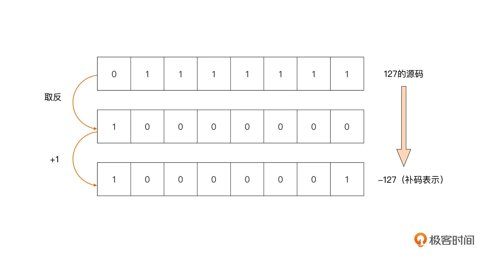

## note
### 变量声明

如果没有显式为变量赋予初值，Go 编译器会为变量赋予这个类型的零值。 整数类型是0、浮点类型是0.0 、布尔是false、指针、接口、切片、channel、map和函数是nil

### 区别总结空结构和空接口

- struct{} 是一个空结构体，表示一个不包含任何字段的结构体；而 interface{} 是一个空接口，表示一个不包含任何方法的接口。
- 空结构体通常用于表示不需要存储任何数据的情况，而空接口通常用于表示不限定具体类型的情况。
- 空结构体在并发编程中常用作信号或事件的通知；空接口常用于需要接收任意类型的值的场景。

在实际编程中，空结构体和空接口都有其特定的用途，可以根据具体情况选择使用。

### byte类型 => 字节类型

在 gRPC 请求中，byte 类型通常用于表示二进制数据，例如文件内容、图像数据、视频数据等。gRPC 使用 Protocol Buffers 作为默认的序列化和反序列化格式，而 Protocol Buffers 支持将二进制数据表示为字节序列。

在 gRPC 中，您可能会使用 byte 类型来传输二进制数据。例如，如果您有一个 gRPC 服务，需要接收一个文件作为输入，您可以将文件内容表示为 byte 类型，并在 gRPC 请求中传输这些字节。
```
// 定义 gRPC 请求消息
message UploadFileRequest {
  bytes file_content = 1;
}
// 生成的 gRPC 服务端代码
func (s *Server) UploadFile(ctx context.Context, req *pb.UploadFileRequest) (*pb.UploadFileResponse, error) {
    fileContent := req.GetFileContent()
    // 处理文件内容
    return &pb.UploadFileResponse{}, nil
}

```
### go vet
Go 官方提供了 go vet 工具可以用于对 Go 源码做一系列静态检查
```shell
go install golang.org/x/tools/go/analysis/passes/shadow/cmd/shadow@latest
go: downloading golang.org/x/tools v0.1.5
go: downloading golang.org/x/mod v0.4.2
```
我们就可以通过 go vet 扫描代码并检查这里面有没有变量遮蔽的问题

```shell
go vet -vettool=$(which shadow) -strict complex.go 
./complex.go:13:12: declaration of "err" shadows declaration at line 11
```
### 代码块与作用域(避免变量遮蔽的原则)

代码块有显式与隐式之分，显式代码块就是包裹在一对配对大括号内部的语句序列，而隐式代码块则不容易肉眼分辨，它是通过 Go 语言规范明确规定的。隐式代码块有五种，分别是宇宙代码块、包代码块、文件代码块、分支控制语句隐式代码块，以及 switch/select 的子句隐式代码块，理解隐式代码块是理解代码块概念以及后续作用域概念的前提与基础。

作用域的概念是 Go 源码编译过程中标识符（包括变量）的一个属性。Go 编译器会校验每个标识符的作用域，如果它的使用范围超出其作用域，编译器会报错。

不过呢，我们可以使用代码块的概念来划定每个标识符的作用域。划定原则就是声明于外层代码块中的标识符，其作用域包括所有内层代码块。但是，Go 的这种作用域划定也带来了变量遮蔽问题。简单的遮蔽问题，我们通过分析代码可以很快找出，复杂的遮蔽问题，即便是通过 go vet 这样的静态代码分析工具也难于找全。

因此，我们只有了解变量遮蔽问题本质，在日常编写代码时注意同名变量的声明，注意短变量声明与控制语句的结合，才能从根源上尽量避免变量遮蔽问题的发生。

### go类型系统

Go 语言的类型大体可分为基本数据类型(整型溢出问题、整型符号位采用 2 的补码但是格式化字面值仍是用原码)、复合数据类型(z=a+bi)和接口类型这三种。

Go 的补码是通过原码逐位取反后再加 1 得到的，比如，我们以 -127 这个值为例，它的补码转换过程就是这样的：

计算机中负数用的是补码表示。 负数的补码是其绝对值取反码，再加1.

float 其实相当复杂，开发中如果能避开就避开，例如金钱单位只有美元或者人民币我建议以分作为单位或者使用decimal

#### 进制转换
- 10进制 => 八进制、十六进制、二进制 => 整数部分：除以进制数，反向取余数，直到商为0终止。小数部分：乘以进制数，取整顺序输出。
- 二进制、八进制、十六进制 => 十进制 => 二进制、八进制、十六进制转换为十进制当中的整数部分从右往左指数从0开始递增，小数部分从左往右从-1开始递减，原理都是一样的。

