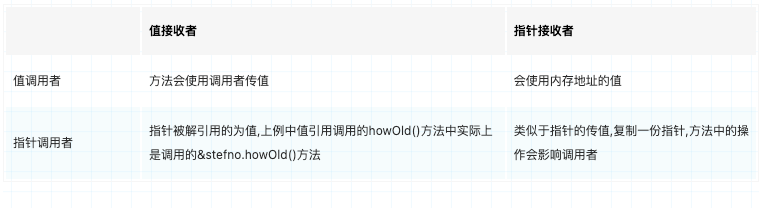
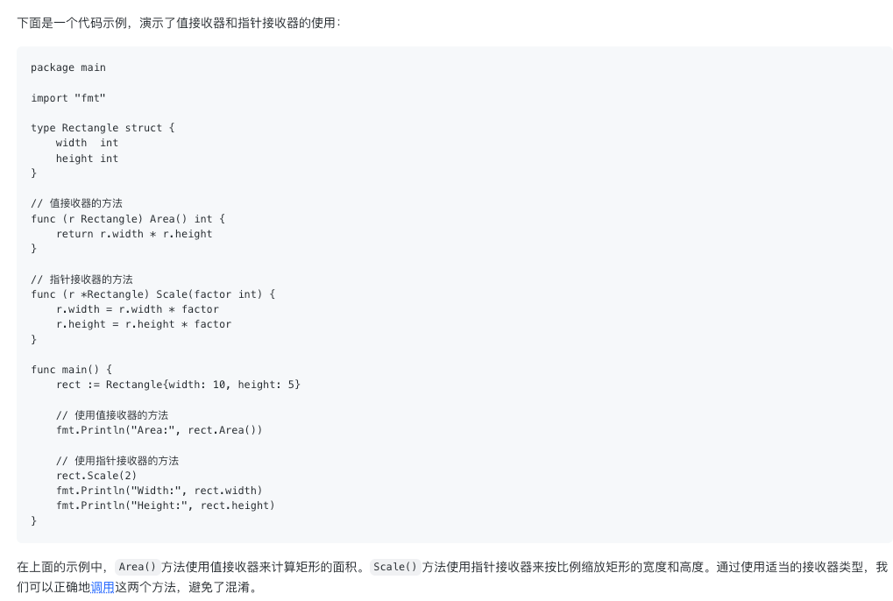

### 评论
- 生产项目一般不会将配置“硬编码”进去的。一般而言，配置项会存储在配置文件中，也有通过命令行参数传入程序的，也可以通过环境变量传入程序。
Go标准库没有内置配置读写框架，目前go社区应用较多的第三方库是Go核心团队成员开发的viper(github.com/spf13/viper)。
对于一些更大的平台，常常有很多服务，这些服务的配置一般存储在专门的配置中心中，由配置中心管理与分发。
- 读写锁和互斥锁
- 程序组织结构。Init 注册机制，读写锁对 Map的保护，channel 和 select 的细节，指针解引用时的复制行为，几个标准库的用法，接口实现类型到底选指针，还是值的考量等等

### 示例请求
```
// 新增某个书籍
curl -X POST -H "Content-Type:application/json" -d '{"id": "978-7-111-55842-2", "name": "The Go Programming Language", "authors":["Alan A.A.Donovan", "Brian W. Kergnighan"],"press": "Pearson Education"}' localhost:8080/book/create
// 更新某个书籍
curl -X POST -H "Content-Type:application/json" -d '{"id": "978-7-111-55842-2", "name": "The Go Programming Language update", "authors":["Alan A.A.Donovan", "Brian W. Kergnighan"],"press": "Pearson Education update"}' localhost:8080/book/978-7-111-55842-2
// 删除某个书籍
curl -X DELETE -H "Content-Type:application/json"  localhost:8080/book/978-7-111-55842-2
// 获取某个书籍
curl -X GET -H "Content-Type:application/json"  localhost:8080/book/978-7-111-55842-2
// 获取全部书籍
 curl -X GET -H "Content-Type:application/json"  localhost:8080/book   
      
```
### go语言中什么时候使用指针

在 Go 编程中，决定是否使用指针传递参数和返回值取决于几个因素，包括性能、内存使用、功能需求和代码可读性。以下是一些指导原则，帮助你决定何时使用指针传递，何时直接传递值。

- 参数传递
  - 何时使用指针传递
    - 大型结构体：如果结构体很大，传递指针比传递整个结构体的副本更高效
    - 共享和修改状态：当需要在函数之间共享和修改同一个实例时，使用指针。例如，传递上下文、配置对象等。
    - 结构体方法接收器：如果方法需要修改结构体的字段，接收器应使用指针。
    - 避免不必要的内存拷贝：在性能关键的代码路径中，使用指针可以避免频繁的内存拷贝。
  - 何时直接传递值
    - 小型结构体：对于小型结构体，传递值更简单且性能开销可以忽略不计。
    - 不可变对象：对于不需要修改的对象，直接传递值可以确保对象的不可变性，增加代码的安全性和可读性。
    - 短生命周期对象：如果对象的生命周期很短，仅在函数内使用，可以直接传值，代码更简洁。
    - 基本类型：基本类型（如整数、浮点数、布尔值、字符串等）本身是小型数据结构，直接传递值更为自然。
- 函数返回
  - 返回指针
    - 需要修改返回值的内容
    - 返回较大的结构体
    - 避免拷贝开销需要表示不存在的值或错误（使用 nil）
    - 结构体的方法接收器是指针类型
  - 返回非指针
    - 返回较小的结构体
    - 返回不可变的对象
    - 返回短生命周期的对象
    - 函数组合和嵌套时返回临时值

### 指针、实例和接口

指针、实例和接口在 Go 语言中是三个重要的概念，它们之间有一定的关系，但又各自有不同的作用。让我逐个解释它们之间的关系：
1. 指针（Pointer）
   - 指针是一个变量，存储了另一个变量的内存地址。通过指针，我们可以直接访问和修改变量的值，而不是复制变量的副本。指针通常用于以下几个方面：
     - 传递和修改数据：通过指针可以在函数之间传递和修改数据，避免了数据的复制，提高了性能。
     - 动态分配内存：通过指针可以在运行时动态分配内存，例如使用 new() 或 make() 函数创建新的对象。
     - 数据结构：在数据结构中，指针常用于构建链表、树等动态结构。
2. 实例（Instance）
   - 实例是指某个类型的具体变量，是该类型的一个具体实现。在 Go 中，实例通常通过 new() 函数或结构体字面量的方式创建。 例如，对于一个结构体类型 Person，可以通过以下方式创建实例：
```
  type Person struct {
      Name string
      Age  int
  }
  
  func main() {
      // 通过 new() 函数创建实例
      p1 := new(Person)
      p1.Name = "Alice"
      p1.Age = 30
  
      // 通过结构体字面量创建实例
      p2 := Person{
          Name: "Bob",
          Age:  25,
      }
  }
```
3. 接口（Interface）
   接口是一种抽象类型，定义了一组方法的集合。任何类型只要实现了接口中的所有方法，就被认为是该接口的实现。 接口在 Go 中有着重要的作用，可以用于实现多态性和组件化开发。
   - 接口的使用场景包括：
     - 解耦：通过接口可以将实现细节和接口定义分离，提高了代码的灵活性和可维护性。
     - 多态：不同类型的实例可以通过同一个接口进行统一管理和调用，实现了多态性。
     - 扩展性：接口可以被其他包实现，使得代码更容易扩展和复用。
#### 关系
  - 指针和实例：指针用于直接操作内存地址，而实例则是存储在内存中的具体变量。指针可以指向实例的内存地址，通过指针可以修改实例的值。
  - 指针和接口：指针类型可以实现接口，只要实现了接口中的方法即可。通过指针实现的接口可以使得多个不同类型的实例通过相同的接口进行调用。
  - 实例和接口：实例可以实现接口，即实现了接口中的方法。一个具体类型的实例可以赋值给接口类型的变量，从而实现多态性和解耦。

总结： 指针用于管理实例，实例实现接口的方法，接口提供了多态性。

### 方法接收器
在 Go 语言中，方法接收器可以是值类型（value receiver）或指针类型（pointer receiver）。它们在方法调用和方法对接收器进行操作时有着不同的行为和语义。
  - 值类型接收器（Value Receiver）
    - 值类型接收器将方法绑定到了一个类型的副本上，这意味着在方法内部对接收器的修改不会影响到原始值，因为是操作的副本。值类型接收器通常适用于以下情况：
      - 不需要修改接收器的状态，只是需要使用接收器的值进行操作。
      - 值类型对象较小，复制的开销较小，或者是不可变对象。
      - 如果接收器为map、func、chan或slice等类型或者接收器是一个小数组或结构，它自然是一个值类型（例如，类似 time.Time 类型），没有可变字段和指针，或者只是一个简单的基本类型，如 int 或 string，则 值接收器是有道理的。值接收器可以减少可以生成的垃圾量； 如果将值传递给值方法，则可以使用堆栈上的副本而不是在堆上分配。 （编译器试图巧妙地避免这种分配，但它并不总是成功。）不要在没有首先进行分析的情况下选择值接收器类型。
```
type Rectangle struct {
    Width, Height int
}

func (r Rectangle) Area() int {
    return r.Width * r.Height
}

```
  - 指针类型接收器（Pointer Receiver）
    - 指针类型接收器将方法绑定到了一个类型的指针上，这意味着在方法内部对接收器的修改会直接影响到原始值。指针类型接收器通常适用于以下情况：
      - 需要修改接收器的状态，或者是需要在方法内部改变接收器的指向。
      - 值类型对象较大，复制的开销较大，比如大struct或array。
      - 需要避免方法调用过程中的值复制开销，或者是需要保证方法调用能够影响到原始值。
      - 如果接收器是一个struct类型并包含sync.Mutex或synchronizing属性，则接收器需要定义为指针类型来避免复制 
      - 如果接收器是一个struct、array或slice，且他的元素是指针类型或可变的字段，则推荐定义为指针类型，因为它会使读者更清楚意图。
```
type Counter struct {
    count int
}

func (c *Counter) Increment() {
    c.count++
}

```
- 区别
  - 修改原始值：值类型接收器操作的是副本，不会影响原始值；指针类型接收器操作的是原始值，会直接修改原始值。
  - 性能开销：值类型接收器的方法调用会涉及值的复制，而指针类型接收器的方法调用只涉及指针的传递，性能开销较小。
  - 可变性：指针类型接收器的方法可以修改接收器的状态，而值类型接收器的方法不能修改接收器的状态。
  - 方法调用方式：值类型接收器的方法可以直接调用，而指针类型接收器的方法需要使用指针来调用。
- 如何选择
  - 如果需要修改接收器的状态，或者操作的对象较大，应该选择指针类型接收器。
  - 如果不需要修改接收器的状态，并且对象较小或不可变，应该选择值类型接收器。

综上所述，值类型和指针类型接收器在方法调用和方法对接收器进行操作时有着不同的行为和语义，根据实际需求选择合适的接收器类型可以提高代码的可读性、性能和可维护性。
当有疑问，选择用指针还是值接收器，则推荐使用指针接收器
同一个struct的方法接收器的定义，不建议即有指针类型又有值类型。要么全部定义为值类型，要么全部定义为指针类型

### 如何理解：Go 在方法调用时会自动将值转换为指针，所以方法的接收器可以是值类型也可以是指针类型。这样，我们可以通过指针和非指针类型来实现接口。
当一个方法的接收器是一个值类型时，在调用该方法时，如果接收器是一个指针，Go 语言会自动地对该指针进行解引用，并将其转换为对应的值类型。这个过程被称为自动解引用。
```
// 示例1
type MyStruct struct {
    Data int
}

// 值类型接收器的方法
func (m MyStruct) GetValue() int {
    return m.Data
}

func main() {
    // 创建一个 MyStruct 实例
    myVar := MyStruct{Data: 42}

    // 调用 GetValue 方法时，传递的是值类型
    fmt.Println(myVar.GetValue()) // 输出 42
}

// 示例2
type MyStruct struct {
    Data int
}

// 指针类型接收器的方法
func (m *MyStruct) GetValue() int {
    return m.Data
}

func main() {
    // 创建一个 MyStruct 实例
    myVar := MyStruct{Data: 42}

    // 调用 GetValue 方法时，传递的是实例的指针
    fmt.Println(myVar.GetValue()) // 输出 42
}


```

两者分 别在何时使用

如果方法的接收者是值类型，无论调用者是对象还是对象指针，修改的都是对象的副本，不影响调用者:如果方法的接收者是指针类型，则调用者修改的是指针指向的对象本身。
使用指针作为方法的接收者的理由如下:

1)方法能够修改接收者指向的值。

2)避免在每次调用方法时复制该值，在值的类型为大型结构体时，这样做会更加高效。

但是决定使用值接收者还是指针接收者，不是由该方法是否修改了调用者( 也就是接收者)，而是应该基于该类型的本质。
如果类型具备“原始的本质”，也就是说它的成员都是由Go语言里内置的原始类型，如字符 串、整型值等构成，那就定义值接收者类型的方法。像内置的引用类型，如slice、 map、 interface. channel, 这些类型比较特殊，声明它们的时候，实际上是创建了-一个header, 对于它们 也是直接定义值接收者类型的方法。这样，调用函数时，是直接复制了这些类型的header, 而header本身就是为复制设计的。这种也应该是声明值接收者类型的方法。
如果类型具备非原始的本质，不能被安全地复制，这种类型总是应该被共享，那就定义指针接 收者的方法。比如Go源码里的文件结构体(stmuet Fil)就不应该被复制，应该只有一份实体， 就要定义指针接收者类型的方法。

最后 如果实现了接收者是值类型的方法,会隐含的也实现了接收者是指针类型的方法



### go泛型
1. 泛型的设计原理和产生历史
2. 了解类型参数
3. 定义泛型约束
4. 明确使用场景
```
package main

import (
    "sort"
    "testing"
)

// 如何在 Go 语言中使用泛型实现一个通用的排序方法，能够对 int 和 string 类型的切片进行排序。
// sort.Interface -> IntSlice / StringSlice 泛型版
// 定义了一个泛型约束接口 xsl，它限制了泛型类型参数必须是 int 或 string 类型。
type xsl interface {
    // 这里的 ~ 符号表示这个接口可以接受具体类型或其别名，例如 type myint int 也是被允许的。
	~int | ~string
}
// 定义了一个泛型切片类型 xSlice，它可以存储任意实现 xsl 接口的类型。
type xSlice[T xsl] []T

// 实现 sort.Interface

// 为了使用 sort.Sort 方法排序，我们需要实现 sort.Interface 接口。
// 我们为 xSlice 类型实现了这个接口的三个方法：Len、Less 和 Swap。
// 长度
func (x xSlice[T]) Len() int           { return len(x) }
// 比较大小
func (x xSlice[T]) Less(i, j int) bool { return x[i] < x[j] }
// 交换位置
func (x xSlice[T]) Swap(i, j int)      { x[i], x[j] = x[j], x[i] }
// 定义一个通用的排序函数 sortX，它接收一个 xSlice 类型的数据并调用 sort.Sort 进行排序。
func sortX[T xsl](data xSlice[T]) {
	sort.Sort(data)
}
// 在 TestXSlice 测试函数中，我们测试了对 int 类型和 string 类型的切片进行排序。
// *testing.T 是一个指向 testing.T 类型的指针，用于在测试函数中记录测试状态和输出测试日志。testing.T 是标准库 testing 包中的一个类型，它提供了很多用于编写测试代码的方法。
func TestXSlice(t *testing.T) {
// // 测试 int 切片排序
	x1 := make(xSlice[int], 0, 5)
	x1 = append(x1, 3)
	x1 = append(x1, 10)
	x1 = append(x1, 2)
	x1 = append(x1, 0)
	x1 = append(x1, 9)
	sortX(x1)
	t.Logf("[]~int x = %#v", x1) // 输出排序后的 int 切片
    // 测试 string 切片排序 
	type mystr string
	x2 := []mystr{"ab", "ca", "fc", "ce", "bf"}
	sortX(x2)
	t.Logf("[]~string x = %#v", x2) // 输出排序后的string切片
	
    // 验证排序结果是否正确
    expectedInt := xSlice[int]{0, 2, 3, 9, 10}
    for i, v := range x1 {
        if v != expectedInt[i] {
            t.Errorf("expected %d, got %d", expectedInt[i], v)
        }
    }

    expectedString := xSlice[mystr]{"ab", "bf", "ca", "ce", "fc"}
    for i, v := range x2 {
        if v != expectedString[i] {
            t.Errorf("expected %s, got %s", expectedString[i], v)
        }
    }
}

```


