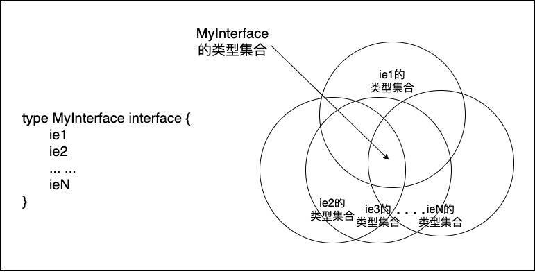

### 泛型
https://learn.lianglianglee.com/%e4%b8%93%e6%a0%8f/Tony%20Bai%20%c2%b7%20Go%e8%af%ad%e8%a8%80%e7%ac%ac%e4%b8%80%e8%af%be/%e5%8a%a0%e9%a4%90%20%e8%81%8a%e8%81%8a%e6%9c%80%e8%bf%91%e5%a4%a7%e7%83%ad%e7%9a%84Go%e6%b3%9b%e5%9e%8b.md
> 算法与类型解耦
### go中的泛型
为什么Go不早点加入泛型呢？其实这个问题在Go FAQ中早有答案，我总结一下大概有三点主要理由：

- 这个语法特性不紧迫，不是Go早期的设计目标；
- 与简单的设计哲学有悖；
- 尚未找到合适的、价值足以抵消其引入的复杂性的理想设计方案。 
### go泛型语法

- 做约束的接口类型与做传统接口的接口类型最好要分开定义，除非约束类型真的既需要方法集合，也需要类型列表。
- 类型具化（instantiation）- 具化（instantiation）就好比一家生产“排序机器”的工厂根据要排序的对象的类型，将这样的机器生产出来的过程。
- 有了对类型参数的实参类型的自动推导，大多数泛型函数的调用方式与常规函数调用一致，不会给 Gopher 带去额外的代码编写负担。
- 除了函数可以携带类型参数变身为“泛型函数”外，类型也可以拥有类型参数而化身为“泛型类型”

[了解类型参数](https://learn.lianglianglee.com/%e4%b8%93%e6%a0%8f/Tony%20Bai%20%c2%b7%20Go%e8%af%ad%e8%a8%80%e7%ac%ac%e4%b8%80%e8%af%be/39%20%e9%a9%af%e6%9c%8d%e6%b3%9b%e5%9e%8b%ef%bc%9a%e4%ba%86%e8%a7%a3%e7%b1%bb%e5%9e%8b%e5%8f%82%e6%95%b0.md)

Go泛型方案的实质是对类型参数（type parameter）的支持，包括：
- 泛型函数（generic function）：带有类型参数的函数；
- 泛型类型（generic type）：带有类型参数的自定义类型；
- 泛型方法（generic method）：泛型类型的方法。

[定义泛型约束](https://learn.lianglianglee.com/%e4%b8%93%e6%a0%8f/Tony%20Bai%20%c2%b7%20Go%e8%af%ad%e8%a8%80%e7%ac%ac%e4%b8%80%e8%af%be/40%20%e9%a9%af%e6%9c%8d%e6%b3%9b%e5%9e%8b%ef%bc%9a%e5%ae%9a%e4%b9%89%e6%b3%9b%e5%9e%8b%e7%ba%a6%e6%9d%9f.md)

在Go泛型语法中，我们使用类型参数约束（type parameter constraint）（以下简称约束）
- 最宽松的约束：any
- 支持比较操作的内置约束：comparable => 根据其注释说明，所有可比较的类型都实现了comparable这个接口，包括：布尔类型、数值类型、字符串类型、指针类型、channel类型、元素类型实现了comparable的数组和成员类型均实现了comparable接口的结构体类型。
- 自定义约束：凡是接口类型均可作为类型参数的约束。
  - Go接口类型声明语法做了扩展，支持在接口类型中放入类型元素（type element）信息 => 加上对排序行为的支持(ordered)
```go
type ordered interface {
	~int | ~int8 | ~int16 | ~int32 | ~int64 |
	~uint | ~uint8 | ~uint16 | ~uint32 | ~uint64 | ~uintptr |
	~float32 | ~float64 | ~string
}
```
扩展后的接口类型定义的组成示意图


> 新的接口类型依然可以嵌入其他接口类型，满足组合的设计哲学；除了嵌入的其他接口类型外，其余的组成元素被称为接口元素（interface element）。

> 接口元素也有两类，一类就是常规的方法元素（method element），每个方法元素对应一个方法原型；另一类则是此次扩展新增的类型元素（type element），即在接口类型中，我们可以放入一些类型信息，就像前面的ordered接口那样。

> 类型元素可以是单个类型，也可以是一组由竖线“|”连接的类型，竖线“|”的含义是“并”，这样的一组类型被称为union element。无论是单个类型，还是union element中由“|”分隔的类型，如果类型中不带有“~”符号的类型就代表其自身；而带有“~”符号的类型则代表以该类型为底层类型(underlying type)的所有类型

> 要注意的是：union element中不能包含带有方法元素的接口类型，也不能包含预定义的约束类型，如comparable。

扩展后接口类型分类

> 一类是基本接口类型（basic interface type），即其自身和其嵌入的接口类型都只包含方法元素，而不包含类型元素。基本接口类型不仅可以当做常规接口类型来用，即声明接口类型变量、接口类型变量赋值等，还可以作为泛型类型参数的约束。

> 除此之外的非空接口类型都属于非基本接口类型，即直接或间接（通过嵌入其他接口类型）包含了类型元素的接口类型。这类接口类型仅可以用作泛型类型参数的约束，或被嵌入到其他仅作为约束的接口类型中

类型集合（type set），类型集合将作为后续判断类型是否满足约束的基本手段。
- 每个类型都有一个类型集合；
- 非接口类型的类型的类型集合中仅包含其自身，比如非接口类型T，它的类型集合为{T}，即集合中仅有一个元素且这唯一的元素就是它自身。

我们最终要搞懂的是用于定义约束的接口类型的类型集合，所以以上这两点都是在为下面接口类型的类型集合定义做铺垫，定义如下：
- 空接口类型（any或interface{}）的类型集合是一个无限集合，该集合中的元素为所有非接口类型。这个与我们之前的认知也是一致的，所有非接口类型都实现了空接口类型；
- 非空接口类型的类型集合则是其定义中接口元素的类型集合的交集（如下图）。


由此可见，要想确定一个接口类型的类型集合，我们需要知道其中每个接口元素的类型集合。

上面我们说过，接口元素可以是其他嵌入接口类型，可以是常规方法元素，也可以是类型元素。当接口元素为其他嵌入接口类型时，该接口元素的类型集合就为该嵌入接口类型的类型集合；而当接口元素为常规方法元素时，接口元素的类型集合就为该方法的类型集合。

[明确使用时机](https://learn.lianglianglee.com/%e4%b8%93%e6%a0%8f/Tony%20Bai%20%c2%b7%20Go%e8%af%ad%e8%a8%80%e7%ac%ac%e4%b8%80%e8%af%be/41%20%e9%a9%af%e6%9c%8d%e6%b3%9b%e5%9e%8b%ef%bc%9a%e6%98%8e%e7%a1%ae%e4%bd%bf%e7%94%a8%e6%97%b6%e6%9c%ba.md)
- 场景一：编写通用数据结构时
> 在Go尚不支持泛型的时候，如果要实现一个通用的数据结构，比如一个先入后出的stack数据结构，我们通常有两个方案。
   1. 第一种方案是为每种要使用的元素类型单独实现一套栈结构。如果我们要在栈里管理int型数据，我们就实现一个IntStack；如果要管理string类型数据，我们就再实现一个StringStack……总之，我们需要根据可能使用到的元素类型实现出多种专用的栈结构。
   
      - 这种方案的优点是便于编译器的静态类型检查，保证类型安全，且运行性能很好，因为Go编译器可以对代码做出很好的优化。不过这种方案的缺点也很明显，那就是会有大量的重复代码。
   2. 第二种方案是使用interface{}实现通用数据结构。在泛型之前，Go语言中唯一具有“通用”语义的语法就是interface{}了。无论Go标准库还是第三方实现的通用数据结构都是基于interface{}实现的 
      - 使用interface{}固然可以实现通用数据结构，但interface{}接口类型的固有特性也决定了这个方案也自带以下“先天不足”：
         - Go编译器无法在编译阶段对进入数据结构中的元素的类型进行静态类型检查；
         - 要想得到元素的真实类型，不可避免要进行类型断言或type switch操作；
         - 不同类型数据赋值给interface{}或从interface{}还原时执行的装箱和拆箱操作带来的额外开销。
- 场景二：函数操作的是Go原生的容器类型时
- 场景三：不同类型实现一些方法的逻辑相同时
> Go 泛型也称为类型参数，我们可以在函数声明、方法声明的 receiver 部分或类型定义中使用类型参数，来实现泛型函数和泛型类型。我们还需为类型参数设定约束，通过扩展的 interface 类型定义，我们可以定义这种约束。

### Go 泛型的性能
- Go 1.18 编译器的性能要比 Go 1.17 下降 15% 左右。
### Go 泛型的使用建议
1. 使用使用go泛型的场景
   - 类型参数的一种有用的情况，就是当编写的函数的操作元素的类型为 slice、map、 channel 等特定类型的时候。如果一个函数接受这些类型的形参，并且函数代码没有对参数的元素类型作出任何假设，那么使用类型参数可能会非常有用。在这种场合下，泛型方案可以替代反射方案，获得更高的性能。
   - 另一个适合使用类型参数的情况是编写通用数据结构。所谓的通用数据结构，指的是像切片或 map 这样，但 Go 语言又没有提供原生支持的类型。比如一个链表或一个二叉树。
   - 另外，在一些场合，使用类型参数替代接口类型，意味着代码可以避免进行类型断言（type assertion），并且在编译阶段还可以进行全面的类型静态检查。
2. 什么情况不宜使用泛型
   - 使用类型参数的原因是它们让你的代码更清晰，如果它们会让你的代码变得更复杂，就不要使用。
   - 当不同的类型使用一个共同的方法时，如果一个方法的实现对于所有类型都相同，就使用类型参数；相反，如果每种类型的实现各不相同，请使用不同的方法，不要使用类型参数。
### Go泛型实现原理简介
- Stenciling方案
> Stenciling方案也称为模板方案（如上图）， 它也是C++、Rust等语言使用的实现方案。其主要思路就是在编译阶段，根据泛型函数调用时类型实参或约束中的类型元素，为每个实参类型或类型元素中的类型生成一份单独实现。

- Dictionaries方案
> Dictionaries方案与Stenciling方案的实现思路正相反，它不会为每个类型实参单独创建一套代码，反之它仅会有一套函数逻辑，但这个函数会多出一个参数dict，这个参数会作为该函数的第一个参数，这和Go方法的receiver参数在方法调用时自动作为第一个参数有些类似。这个dict参数中保存泛型函数调用时的类型实参的类型相关信息。


> 包含类型信息的字典是Go编译器在编译期间生成的，并且被保存在ELF的只读数据区段（.data）中，传给函数的dict参数中包含了到特定字典的指针。从方案描述来看，每个dict中的类型信息还是十分复杂的，不过我们了解这些就够了，对dict的结构就不展开说明了。

> 这种方案也有自身的问题，比如字典递归的问题，如果调用某个泛型函数的类型实参有很多，那么dict信息也会过多等等。更重要的是它对性能可能有比较大的影响，比如通过dict的指针的间接类型信息和方法的访问导致运行时开销较大；再比如，如果泛型函数调用时的类型实参是int，那么如果使用Stenciling方案，我们可以通过寄存器复制即可实现x=y的操作，但在Dictionaries方案中，必须通过memmove了。
- Go最终采用的方案：GC Shape Stenciling方案
> GC Shape Stenciling方案顾名思义，它基于Stenciling方案，但又没有为所有类型实参生成单独的函数代码，而是以一个类型的GC shape为单元进行函数代码生成。一个类型的GC shape是指该类型在Go内存分配器/垃圾收集器中的表示，这个表示由类型的大小、所需的对齐方式以及类型中包含指针的部分所决定。

> 这样一来势必就有GC shape相同的类型共享一个实例化后的函数代码，那么泛型调用时又是如何区分这些类型的呢？

> 答案就是字典。该方案同样在每个实例化后的函数代码中自动增加了一个dict参数，用于区别GC shape相同的不同类型。可见，GC Shape Stenciling方案本质上是Stenciling方案和Dictionaries方案的混合版，它也是Go 1.18泛型最终采用的实现方案，为此Go团队还给出一个更细化、更接近于实现的GC Shape Stenciling实现方案。

> 下面是GC Shape Stenciling方案的示意图：


### 泛型对执行效率的影响
> 通过上面对Go泛型实现原理的了解，我们看到目前的Go泛型实现选择了一条折中的路线：既没有选择纯Stenciling方案，避免了对Go编译性能带去较大影响，也没有选择像Java那样泛型那样的纯装箱和拆箱方案，给运行时带去较大开销。

> 在Go 1.20版本中，由于将使用Unified IR（中间代码表示）替换现有的IR表示，Go泛型函数的执行性能将得到进一步优化，上述的benchmark中两个函数的执行性能将不分伯仲，Go 1.19中也可使用GOEXPERIMENT=unified来开启Unified IR试验性功能。

> 综上，我建议你在一些性能敏感的系统中，还是要慎用尚未得到足够性能优化的泛型；而在性能不那么敏感的情况下，在符合前面泛型使用时机的时候，我们还是可以大胆使用泛型语法的。

### go中的指针类型

[指针](https://learn.lianglianglee.com/%e4%b8%93%e6%a0%8f/Tony%20Bai%20%c2%b7%20Go%e8%af%ad%e8%a8%80%e7%ac%ac%e4%b8%80%e8%af%be/%e5%8a%a0%e9%a4%90%20%e8%81%8a%e8%81%8aGo%e8%af%ad%e8%a8%80%e7%9a%84%e6%8c%87%e9%92%88.md)

> Go中也有一种指针类型是例外，它不需要基类型，它就是unsafe.Pointer。unsafe.Pointer类似于C语言中的void*，用于表示一个通用指针类型，也就是任何指针类型都可以显式转换为一个unsafe.Pointer，而unsafe.Pointer也可以显式转换为任意指针类型。unsafe.Pointer是Go语言的高级特性，在Go运行时与Go标准库中unsafe.Pointer都有着广泛的应用。
- 通过指针变量读取或修改其指向的内存地址上的变量值，这个操作被称为指针的解引用（dereference）。通过解引用输出或修改的，并不是指针变量本身的值，而是指针指向的内存单元的值。
- 二级指针：二级指针可以用来改变指针变量的值，也就是指针变量的指向。
#### Go中的指针用途与使用限制

用途：

> Go是带有垃圾回收的编程语言，指针在Go中依旧位于C位，它的作用不仅体现在语法层面上，更体现在Go运行时层面，尤其是内存管理与垃圾回收这两个地方，这两个运行时机制只关心指针。

> 在语法层面，相对于“指针为王”的C语言来说，Go指针的使用要少不少，这很大程度上是因为Go提供了更灵活和高级的复合类型，比如切片、map等，并将使用指针的复杂性隐藏在运行时的实现层面了。这样，Go程序员自己就不需要在语法层面通过指针来实现这些高级复合类型的功能。

> 指针无论是在Go中，还是在其他支持指针的编程语言中，存在的意义就是为了是“可改变”。在Go中，我们使用*T类型的变量调用方法、以*T类型作为函数或方法的形式参数、返回*T类型的返回值等的目的，也都是因为指针可以改变其指向的内存单元的值。

> 当然，指针的好处，还包括它传递的开销是常数级的（在x86-64平台上仅仅是8字节的拷贝），可控可预测。无论指针指向的是一个字节大小的变量，还是一个拥有10000个元素的[10000]int型数组，传递指针的开销都是一样的。

限制：

> 限制一：限制了显式指针类型转换(如果要强制转换使用unsafe.Pointer)。

> 限制二：不支持指针运算。

### go并发的常见模式
- 了解基于 CSP 的并发模型与传统基于共享内存的并发模型的区别；
- 了解 Go 为实现 CSP 并发模型而提供的并发原语及功能；
- 掌握常见的并发模式，包括创建模式、管道模式、多种退出模式、超时和取消模式等。